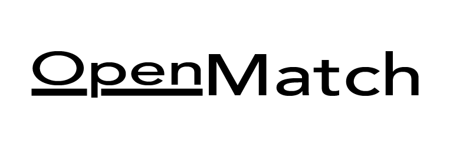

# OpenMatch - Enterprise-Grade Master Data Management Library 🚀

<p align="center" style="background: white;">

</p>

[](https://www.python.org/)
[](LICENSE)
[](#-contributing)

**OpenMatch** is an **enterprise-grade Python library** for comprehensive **Master Data Management (MDM)** solutions. It provides a complete suite of tools for entity resolution, data governance, and master data lifecycle management using cutting-edge AI and scalable architecture.

## 🎯 Core Capabilities

### 1. 🔄 Match & Merge Processing
- ⚡ **Intelligent Matching Engine**
  - Vector embeddings with FAISS for fast approximate matching
  - Configurable matching rules and thresholds
  - Multi-attribute fuzzy matching with weighted scoring
  - Phonetic matching (Soundex, Metaphone) support
  - Address standardization and geocoding

- 🎯 **Advanced Merge Strategies**
  - Rule-based attribute-level merging
  - Configurable merge precedence rules
  - Conflict resolution workflows
  - Bulk merge operations with rollback support
  - Preview merges before commitment

### 2. 🏆 Trust & Survivorship
- 📊 **Data Quality Scoring**
  - Source system reliability ratings
  - Completeness and accuracy metrics
  - Time-based freshness scoring
  - Format validation and standardization

- 🎖️ **Survivorship Rules Engine**
  - Configurable golden record creation
  - Multi-domain survivorship rules
  - Attribute-level survivorship
  - Custom survivorship functions
  - Machine learning-based attribute selection

### 3. 📜 Record History & Lineage
- 🔍 **Cross-Reference Management**
  - Bidirectional xref tracking
  - Source system ID mapping
  - Temporal xref validity
  - Relationship type classification

- 📝 **Change Data Capture**
  - Full audit trail of all changes
  - Before/after value tracking
  - User and system attribution
  - Time-travel querying
  - Change reason documentation

### 4. 🏗️ Enterprise Integration
- 🔌 **Connector Framework**
  - Native Databricks integration
  - Snowflake/Snowpark support
  - Azure Synapse compatibility
  - REST API endpoints
  - Batch and real-time processing

- 🔐 **Governance & Security**
  - Role-based access control
  - Data masking and encryption
  - Compliance audit logging
  - Data retention policies
  - GDPR/CCPA support

---

## 📦 Installation

```bash
pip install openmatch

# Optional features
pip install openmatch[all]  # All features
pip install openmatch[cloud]  # Cloud integrations
pip install openmatch[ml]  # Machine learning extensions
```

## 🚀 Quick Start

```python
from openmatch import MDMPipeline
from openmatch.config import TrustConfig, SurvivorshipRules

# Initialize pipeline with configurations
pipeline = MDMPipeline(
    trust_config=TrustConfig(
        source_reliability={
            "CRM": 0.9,
            "ERP": 0.8,
            "LEGACY": 0.6
        }
    ),
    survivorship_rules=SurvivorshipRules(
        priority_fields={
            "name": ["CRM", "ERP", "LEGACY"],
            "address": ["ERP", "CRM", "LEGACY"]
        }
    )
)

# Sample records from different sources
records = [
    {
        "id": "CRM_001",
        "source": "CRM",
        "name": "Acme Corp",
        "address": "123 Main St",
        "phone": "555-0101",
        "last_updated": "2024-02-25"
    },
    {
        "id": "ERP_101",
        "source": "ERP",
        "name": "ACME Corporation",
        "address": "123 Main Street",
        "phone": "555-0101",
        "last_updated": "2024-02-24"
    }
]

# Process records
result = pipeline.process_records(records)

# Access results
print("Golden Records:", result.golden_records)
print("Cross References:", result.xrefs)
print("Lineage:", result.lineage)
print("Trust Scores:", result.trust_scores)
```

## ⚙️ Core Components

### 1. Match Engine
```python
from openmatch.match import MatchConfig, MatchEngine

match_config = MatchConfig(
    blocking_keys=["zip_code", "name_prefix"],
    comparison_fields=[
        ("name", "fuzzy", 0.8),
        ("address", "address_similarity", 0.7),
        ("phone", "exact", 1.0)
    ],
    min_overall_score=0.85
)
```

### 2. Trust Framework
```python
from openmatch.trust import TrustFramework

trust_rules = {
    "completeness_weight": 0.3,
    "timeliness_weight": 0.4,
    "source_weight": 0.3
}

trust_engine = TrustFramework(trust_rules)
```

### 3. Lineage Tracking
```python
from openmatch.lineage import LineageTracker

lineage = LineageTracker()
lineage.track_merge(source_records, golden_record)
lineage.get_record_history("GOLDEN_001")
```

## 🔧 Advanced Configuration

### Match Rules
```yaml
match_rules:
  - name:
      algorithm: hybrid
      weights:
        exact: 0.3
        fuzzy: 0.5
        phonetic: 0.2
      threshold: 0.85
  
  - address:
      algorithm: address
      parse_components: true
      threshold: 0.75
```

### Survivorship Rules
```yaml
survivorship:
  name:
    strategy: trusted_source
    source_priority: [CRM, ERP, LEGACY]
    
  address:
    strategy: most_recent
    timestamp_field: last_updated
    
  phone:
    strategy: custom
    function: validate_and_format_phone
```

## 📊 Performance & Scalability

- 🚀 Processes millions of records per hour
- 📈 Linear scaling with data volume
- 🌐 Distributed processing support
- 💾 Efficient memory management
- ⚡ Incremental processing capability

## 🗺️ Roadmap

### Immediate Term
- ✅ Core matching engine
- ✅ Basic survivorship rules
- ✅ Lineage tracking
- 🔄 REST API endpoints

### Short Term (3-6 months)
- 🔄 Machine learning-based matching
- 🔄 Advanced survivorship rules
- 🔄 Real-time matching API
- 🔄 Enhanced visualization tools

### Long Term
- 🎯 Graph-based relationships
- 🎯 AI-powered data stewardship
- 🎯 Automated rule learning
- 🎯 Blockchain integration for lineage

## 🤝 Contributing

We welcome contributions! See [CONTRIBUTING.md](CONTRIBUTING.md) for guidelines.

### Development Setup
```bash
# Clone repository
git clone https://github.com/your-org/openmatch.git
cd openmatch

# Create virtual environment
python -m venv venv
source venv/bin/activate  # or `venv\Scripts\activate` on Windows

# Install development dependencies
pip install -e ".[dev]"

# Run tests
pytest tests/
```

## 📚 Documentation

Comprehensive documentation is available at [https://openmatch.readthedocs.io/](https://openmatch.readthedocs.io/)

- 📖 API Reference
- 🎓 Tutorials
- 📋 Best Practices
- 🔍 Examples
- 🛠️ Troubleshooting

## 📄 License

This project is licensed under the MIT License - see the [LICENSE](LICENSE) file for details.

## 🌟 Support & Community

- 💬 [GitHub Discussions](https://github.com/your-org/openmatch/discussions)
- 📧 [Email Support](mailto:support@openmatch.org)
- 🐦 [Twitter](https://twitter.com/openmatch)
- 📱 [Slack Community](https://openmatch.slack.com)

---

🚀 **Ready to master your data? Get started with OpenMatch today!**
